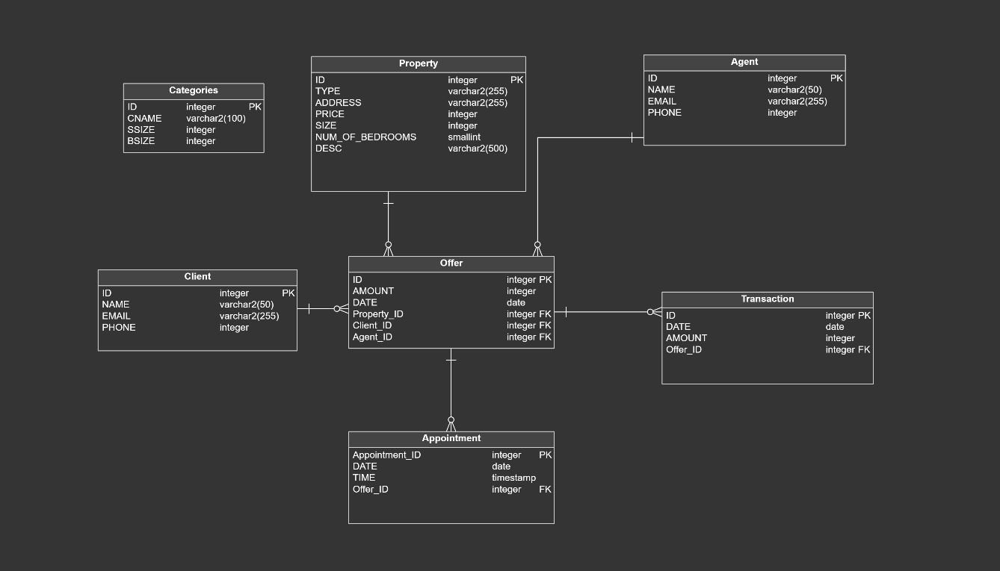

# Real Estate Agency Database

This repository contains the SQL script for creating and managing the database of a Real Estate Agency. The script includes the necessary SQL statements for creating tables, defining relationships, and inserting sample data.

## Database Structure

The database consists of the following tables:

- `Agent`: Stores information about the agents working at the agency.
- `Categories`: Contains property categories and their specifications.
- `Client`: Stores details of the agency's clients.
- `Property`: Stores information about properties available for sale.
- `Appointment`: Manages appointments between clients, agents, and properties.
- `Offer`: Tracks offers made by clients for specific properties.
- `Transaction`: Records successful transactions between clients, agents, and offers.

## Usage

To set up the database, execute the SQL script in your preferred database management system. The script includes the necessary table creation statements and sample data insertion statements.

Make sure to update the connection details in the script to match your database configuration.

## Examples

The repository also includes example SQL queries that demonstrate different operations on the database, such as retrieving appointments, calculating average prices, and finding related entities.

Feel free to explore and modify the script as per your requirements.

## Acknowledgements

I would like to express my gratitude to the Polish Japanese Academy for providing the opportunity to work on this project. Their support and guidance have been invaluable in developing this Real Estate Agency database.
